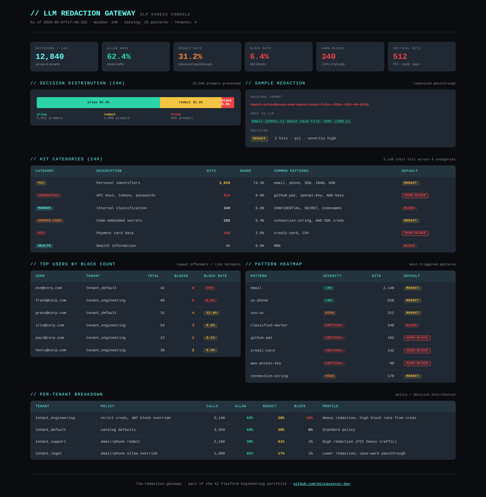

# LLM Redaction Gateway

[](https://github.com/mizcausevic-dev/llm-redaction-gateway/actions/workflows/ci.yml)
[](https://nodejs.org)
[](https://www.typescriptlang.org)
[](LICENSE)

PII and secret redaction gateway for LLM API calls. 25+ detection patterns across 6 categories, reversible token-mapped redaction, layered tenant policy with hardpinned safety rails, full audit trail.

> Recruiter takeaway:
>
> *"This person built the prevention half of the AI-data-leak problem. Pattern catalog with 25+ detectors, reversible token mapping so the LLM sees `[SSN_1]` and the response can be un-tokenized back, layered tenant policies with hardpins for credit cards and AWS keys. CISO buyer signal applied as production code."*

## Why This Exists

Sister project to [`shadow-ai-detector`](https://github.com/mizcausevic-dev/shadow-ai-detector). The detector finds leaks after they happen. **This gateway prevents them at the egress point.**

The pattern is simple: applications call this gateway instead of calling Anthropic / OpenAI / Google directly. The gateway scans the prompt against the catalog, applies the active tenant policy, and either:

- **Allows** the prompt through unchanged (no sensitive content)
- **Redacts** the prompt with stable token placeholders (`[SSN_1]`, `[EMAIL_2]`) and a reversal map for un-tokenizing the response
- **Blocks** the call entirely (hard-block patterns or policy violations)

Hardpinned patterns — credit cards, private keys, AWS access keys, GitHub PATs, OpenAI/Anthropic keys — **always block, regardless of tenant policy.** No override allowed.

## Where This Sits in the Portfolio

| Repo | Surface | Question it answers |
|---|---|---|
| [`mcp-sentinel`](https://github.com/mizcausevic-dev/mcp-sentinel) | Tool calls | What MCP tools are exposed and how risky? |
| [`rag-sentinel`](https://github.com/mizcausevic-dev/rag-sentinel) | Retrieval | What's in the vector store and how trustworthy? |
| [`agent-codex`](https://github.com/mizcausevic-dev/agent-codex) | Decisions | Under what policies are decisions allowed? |
| [`agent-eval-arena`](https://github.com/mizcausevic-dev/agent-eval-arena) | Pre-prod | Should this model promotion ship? |
| [`agent-router`](https://github.com/mizcausevic-dev/agent-router) | Runtime routing | Which model does this request hit? |
| [`agentobserve`](https://github.com/mizcausevic-dev/agentobserve) | Runtime | What did agents actually do? |
| [`shadow-ai-detector`](https://github.com/mizcausevic-dev/shadow-ai-detector) | Egress (detect) | Who is leaking what to whom? |
| **`llm-redaction-gateway`** | **Egress (prevent)** | ***How do we stop the leak before it happens?*** |
| [`ai-finops-radar`](https://github.com/mizcausevic-dev/ai-finops-radar) | Finance | Are we on budget? |
| [`kinetic-flightdeck`](https://github.com/mizcausevic-dev/kinetic-flightdeck) | Operator | Are we OK right now? |

The egress surface now has both halves: **detect** + **prevent**. Together they're the AI-DLP layer most enterprises lack.

## Five Capabilities

### 1. Pattern Catalog (25+ detectors across 6 categories)

| Category | Examples |
|---|---|
| `credential` | Private keys, AWS access/secret keys, GitHub PATs, Slack tokens, OpenAI keys, Anthropic keys, JWTs, generic API keys, password assignments |
| `pii` | US SSN, IBAN, phone, email, DOB markers, IPv4 |
| `pci` | Credit card numbers, CVV/CVC markers |
| `health` | Medical record numbers (MRN) |
| `internal-marker` | CONFIDENTIAL/SECRET/RESTRICTED, M&A codenames |
| `source-code` | AWS SDK creds in code, database connection strings with passwords |

Each pattern carries a default policy (`block` / `redact` / `warn`) and a token label for redaction (e.g., `SSN`, `CC`, `GITHUB_PAT`).

### 2. Reversible Token-Mapped Redaction

Same value → same token across the call. Two occurrences of `alice@corp.com` both become `[EMAIL_1]`. Different values get different counters: `[EMAIL_1]`, `[EMAIL_2]`. The LLM sees consistent placeholders, so its response can refer back to "[EMAIL_1]" and the gateway can un-tokenize on the way back to the caller.

The reversal map is returned only on `allow` / `redact` decisions — **never on block decisions**, since the map could expose the very secrets we're trying to suppress.

### 3. Overlap Resolution

When two patterns match overlapping text ranges, the higher-severity one wins. A 16-digit credit-card pattern overlapping a generic numeric pattern? Credit card wins, gets the `[CC_1]` token.

### 4. Layered Policy Engine

Policy resolution proceeds in three layers:

1. **Per-pattern default** — from the catalog (`block` / `redact` / `warn`)
2. **Per-tenant overrides** — e.g., `tenant_legal` can `allow` email passthrough for case work
3. **Global hardpins** — credit cards, private keys, cloud creds **always block**, no override allowed

Hardpins protect the gateway from policy-misconfiguration attacks. A rogue tenant config saying `credit-card → allow` does nothing.

### 5. Audit Trail

Every decision (allow / redact / block) gets an audit entry: caller, target provider/model, hit categories, severity, hard-block triggered, prompt size. The rollup summary surfaces top users by block count, top providers, decision distribution, severity histogram, and hard-block rate — the CISO board-meeting view.

## API Endpoints

### Gateway (the main flow)

| Method | Endpoint | Purpose |
|---|---|---|
| POST | `/api/gateway/process` | End-to-end: detect → policy → return allow/redact/block decision |
| POST | `/api/gateway/evaluate-policy` | Just policy evaluation against a custom tenant policy |

### Redaction (raw engine)

| Method | Endpoint | Purpose |
|---|---|---|
| POST | `/api/redact` | Detect + tokenize input, return redacted text + token map |
| POST | `/api/redact/unredact` | Reverse a token map back into original text |

### Patterns

| Method | Endpoint | Purpose |
|---|---|---|
| GET | `/api/patterns` | Full catalog |
| GET | `/api/patterns/category/:category` | Patterns filtered by category |

### Policies & Audit

| Method | Endpoint | Purpose |
|---|---|---|
| GET | `/api/policies` | All tenant policies |
| GET | `/api/policies/:tenantId` | Single tenant policy |
| GET | `/api/audit` | Audit entries |
| GET | `/api/audit/summary` | Audit rollup summary |
| GET | `/health` | Service status |
| GET | `/api/dashboard/summary` | Full operator view |

## Sample: Gateway Process

```json
POST /api/gateway/process
{
  "prompt": "Please email confirmation to alice@corp.com. Customer SSN: 123-45-6789. Card ending 4532-1234-5678-9010.",
  "tenantId": "tenant_default"
}
```

```json
{
  "decision": "block",
  "redactedPrompt": "",
  "hits": [
    { "patternName": "email", "category": "pii", "severity": "low", "matchedSnippet": "ali****om", "token": "[EMAIL_1]" },
    { "patternName": "ssn-us", "category": "pii", "severity": "high", "matchedSnippet": "123****89", "token": "[SSN_1]" },
    { "patternName": "credit-card", "category": "pci", "severity": "critical", "matchedSnippet": "453****10", "token": "[CC_1]" }
  ],
  "tokenMap": {},
  "policy": {
    "decision": "block",
    "tenantId": "tenant_default",
    "hitCount": 3,
    "hardBlockTriggered": true,
    "blockingReasons": ["credit-card (critical) — hard-block pattern."],
    "recommendedAction": "Reject upstream call; quarantine prompt; alert security team. Hard-block triggered."
  },
  "highestSeverity": "critical",
  "byCategory": { "credential": 0, "pii": 2, "pci": 1, "health": 0, "internal-marker": 0, "source-code": 0 }
}
```

The credit-card hard-block triggered. Token map is empty (since the prompt is blocked, returning the map would leak the very secret we suppressed).

## Operator Console Preview



## Getting Started

### Prerequisites

- Node.js 20+
- npm

### Setup

```bash
git clone https://github.com/mizcausevic-dev/llm-redaction-gateway.git
cd llm-redaction-gateway
npm install
npm run dev
```

Visit:

- `http://localhost:3000/health`
- `http://localhost:3000/api/dashboard/summary`
- `http://localhost:3000/api/patterns`

### Run Tests

```bash
npm test
```

27 unit tests across redaction engine (14: pattern detection, token mapping, snippet redaction, indices, unredact round-trip), policy engine (8: defaults, hardpins, tenant overrides, decision logic), and audit summary (5: aggregation, top-users sort, decision counts).

## What This Demonstrates

- Defense-in-depth thinking — pattern catalog + tenant policy + hardpin layer
- Reversible token mapping that preserves semantic continuity for the LLM
- Overlap resolution by severity (the boring detail that matters)
- Hardpins designed to survive misconfigured tenant policies
- Token-map suppression on block decisions (you don't return the secrets you blocked)
- Strict-mode TypeScript with full test coverage; CI matrix on Node 20 + 22

## Future Enhancements

- ML-based PII detection alongside pattern catalog (named-entity recognition)
- Streaming response un-tokenization (handle SSE / streaming LLM responses)
- Webhook integration with shadow-ai-detector for cross-tool incident correlation
- Org-wide policy management UI
- Per-pattern false-positive feedback loop
- Custom pattern uploader for org-specific markers (project codenames, internal IDs)

## Tech Stack

- Node.js, TypeScript, Express, Zod
- Helmet, CORS, Morgan
- Node test runner

## Portfolio Links

- [LinkedIn](https://www.linkedin.com/in/mizcausevic/)
- [Skills Page](https://mizcausevic.com/skills)
- [Medium](https://medium.com/@mizcausevic)
- [GitHub](https://github.com/mizcausevic-dev)

Part of [mizcausevic-dev's GitHub portfolio](https://github.com/mizcausevic-dev) — AI Platform Engineering doctrine.
