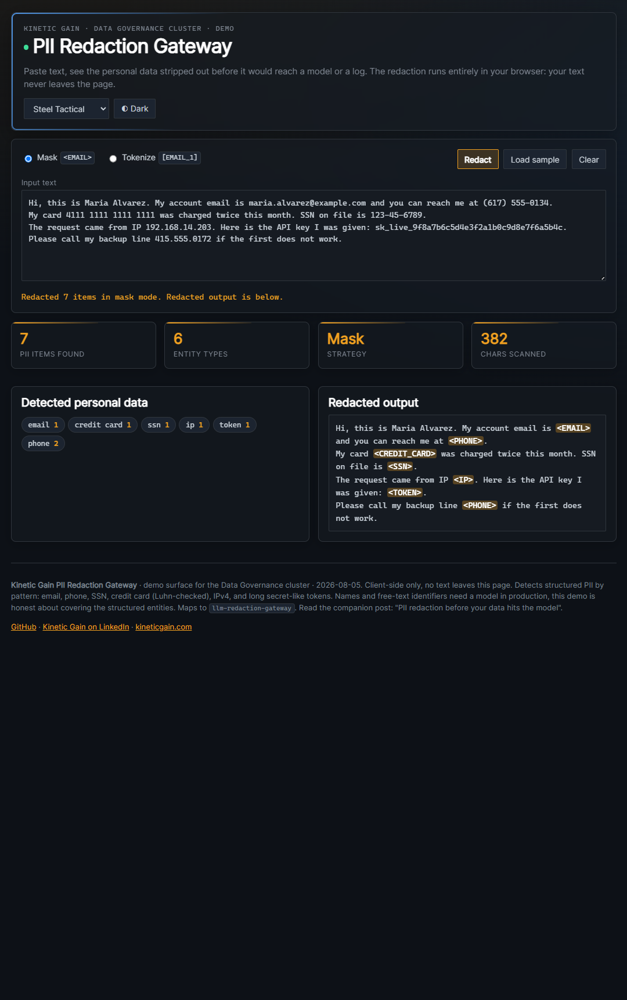
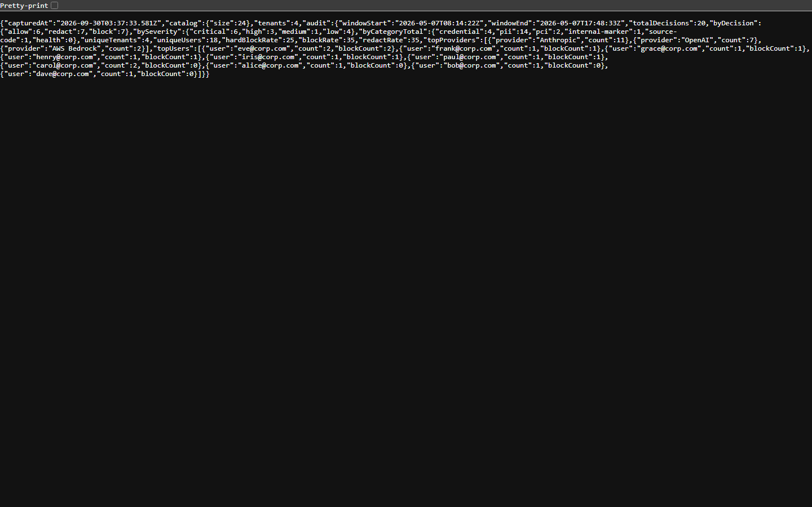

# LLM Redaction Gateway

[](https://redact.kineticgain.com)

**Static demo:** [https://redact.kineticgain.com](https://redact.kineticgain.com). The preview images use synthetic figures; they do not show observed traffic.


[](https://github.com/mizcausevic-dev/llm-redaction-gateway/actions/workflows/ci.yml)
[](https://nodejs.org)
[](https://www.typescriptlang.org)
[](LICENSE)

Local PII and secret redaction **decision prototype**. It evaluates prompts against patterns and sample policy, then returns an allow, redact, or block decision. The default demo does not authenticate tenants. A separate loopback private-pilot mode verifies signed callers and explicit client-to-tenant grants, but neither mode forwards to an LLM provider or writes a live audit trail. Do not deploy this API or send real sensitive data to it.

## Why This Exists

Sister project to [`shadow-ai-detector`](https://github.com/mizcausevic-dev/shadow-ai-detector). This prototype explores the policy decision that would be needed at an egress point.

The local API scans a sample prompt against the catalog, applies sample policy, and returns a decision that a future authenticated proxy could enforce:

- **Allows** a prompt unchanged when the catalog finds no match; detection is not exhaustive
- **Redacts** matched spans with stable token placeholders (`[SSN_1]`, `[EMAIL_2]`); the reversal map stays in process memory
- **Blocks** the call entirely (hard-block patterns or policy violations)

On `/api/gateway/process`, detected hardpinned patterns such as credit cards, private keys, and API keys return a block decision regardless of the sample tenant policy. Pattern matching is heuristic and cannot guarantee complete detection.

## Where This Sits in the Portfolio

| Repo | Surface | Question it answers |
|---|---|---|
| [`mcp-sentinel`](https://github.com/mizcausevic-dev/mcp-sentinel) | Tool calls | What MCP tools are exposed and how risky? |
| [`rag-sentinel`](https://github.com/mizcausevic-dev/rag-sentinel) | Retrieval | What's in the vector store and how trustworthy? |
| [`agent-codex`](https://github.com/mizcausevic-dev/agent-codex) | Decisions | Under what policies are decisions allowed? |
| [`agent-eval-arena`](https://github.com/mizcausevic-dev/agent-eval-arena) | Pre-prod | Should this model promotion ship? |
| [`agent-router`](https://github.com/mizcausevic-dev/agent-router) | Runtime routing | Which model does this request hit? |
| [`agentobserve`](https://github.com/mizcausevic-dev/agentobserve) | Runtime | What did agents actually do? |
| [`shadow-ai-detector`](https://github.com/mizcausevic-dev/shadow-ai-detector) | Egress (detect) | Who is leaking what to whom? |
| **`llm-redaction-gateway`** | **Pre-egress decision prototype** | ***What decision should an enforcing proxy make?*** |
| [`ai-finops-radar`](https://github.com/mizcausevic-dev/ai-finops-radar) | Finance | Are we on budget? |
| [`kinetic-flightdeck`](https://github.com/mizcausevic-dev/kinetic-flightdeck) | Operator | Are we OK right now? |

These adjacent prototypes model detection and decision logic. A production DLP boundary still requires an authenticated enforcing proxy and independent validation.

## Five Capabilities

### 1. Pattern Catalog (25+ detectors across 6 categories)

| Category | Examples |
|---|---|
| `credential` | Private keys, AWS access/secret keys, GitHub PATs, Slack tokens, OpenAI keys, Anthropic keys, JWTs, generic API keys, password assignments |
| `pii` | US SSN, IBAN, phone, email, DOB markers, IPv4 |
| `pci` | Luhn-valid 16-digit card shapes, CVV/CVC markers |
| `health` | Medical record numbers (MRN) |
| `internal-marker` | CONFIDENTIAL/SECRET/RESTRICTED, M&A codenames |
| `source-code` | AWS SDK creds in code, database connection strings with passwords |

Each pattern carries a default policy (`block` / `redact` / `warn`) and a token label for redaction (e.g., `SSN`, `CC`, `GITHUB_PAT`).

### 2. In-process Token-Mapped Redaction

Same value → same token across the call. Two occurrences of `alice@corp.com` both become `[EMAIL_1]`. Different values get different counters: `[EMAIL_1]`, `[EMAIL_2]`. The engine retains a reversal map in memory for local tests. This prototype does not send prompts to an LLM or un-tokenize provider responses.

HTTP responses expose a redacted preview and pattern metadata, never a separate original-prompt field, detected matched values, partial snippets, or a reversal map. When nothing matches, the preview equals the input. Even when a sample tenant policy marks a detected pattern `allow`, the returned prompt remains tokenized. Detection is pattern-based and cannot guarantee that every sensitive value is found.

### 3. Overlap Resolution

When two patterns match overlapping text ranges, the higher-severity one wins. A 16-digit credit-card pattern overlapping a generic numeric pattern? Credit card wins, gets the `[CC_1]` token.

### 4. Layered Policy Engine

Policy resolution proceeds in three layers:

1. **Per-pattern default** — from the catalog (`block` / `redact` / `warn`)
2. **Per-tenant overrides** — e.g., `tenant_legal` can mark email `allow` for the sample decision; the returned prompt still tokenizes matched email addresses
3. **Global hardpins** — credit cards, private keys, cloud creds **always block**, no override allowed

Hardpins protect the gateway from policy-misconfiguration attacks. A rogue tenant config saying `credit-card → allow` does nothing.

### 5. Audit Trail

The audit endpoints summarize a bundled **synthetic fixture**. Runtime decisions are not recorded. A production audit trail would need authenticated caller identity, durable writes, retention rules, deletion controls, and evidence integrity.

## API Endpoints

### Gateway (the main flow)

| Method | Endpoint | Purpose |
|---|---|---|
| POST | `/api/gateway/process` | End-to-end: detect → policy → return allow/redact/block decision |
| POST | `/api/gateway/evaluate-policy` | Just policy evaluation against a custom tenant policy |

### Redaction preview

| Method | Endpoint | Purpose |
|---|---|---|
| POST | `/api/redact` | Detect + tokenize input, return redacted text and safe pattern metadata |

### Patterns

| Method | Endpoint | Purpose |
|---|---|---|
| GET | `/api/patterns` | Full catalog |
| GET | `/api/patterns/category/:category` | Patterns filtered by category |

### Policies & Audit

| Method | Endpoint | Purpose |
|---|---|---|
| GET | `/api/policies` | All tenant policies |
| GET | `/api/policies/:tenantId` | Single tenant policy |
| GET | `/api/audit` | Audit entries |
| GET | `/api/audit/summary` | Audit rollup summary |
| GET | `/health` | Service status |
| GET | `/api/dashboard/summary` | Full operator view |

## Sample: Gateway Process

```json
POST /api/gateway/process
{
  "prompt": "Please email confirmation to alice@corp.com. Customer SSN: 123-45-6789. Card ending 4532-1234-5678-9014.",
  "tenantId": "tenant_default"
}
```

```json
{
  "decision": "block",
  "redactedPrompt": "",
  "hits": [
    { "patternName": "email", "category": "pii", "severity": "low", "startIndex": 29, "endIndex": 43, "tokenLabel": "EMAIL", "token": "[EMAIL_1]" },
    { "patternName": "ssn-us", "category": "pii", "severity": "high", "startIndex": 59, "endIndex": 70, "tokenLabel": "SSN", "token": "[SSN_1]" },
    { "patternName": "credit-card", "category": "pci", "severity": "critical", "startIndex": 84, "endIndex": 103, "tokenLabel": "CC", "token": "[CC_1]" }
  ],
  "policy": {
    "decision": "block",
    "hitCount": 3,
    "hardBlockTriggered": true,
    "blockingReasons": ["credit-card (critical) — hard-block pattern."],
    "recommendedAction": "Block decision: caller must not forward this prompt. No quarantine or alert is performed by this prototype."
  },
  "highestSeverity": "critical",
  "byCategory": { "credential": 0, "pii": 2, "pci": 1, "health": 0, "internal-marker": 0, "source-code": 0 }
}
```

The credit-card hard-block triggered. No prompt or reversal map is returned. The hit positions are illustrative; the endpoint computes them from the submitted text.

## API Snapshot



This browser capture is from the locally running `/api/dashboard/summary` endpoint. The response is generated from bundled synthetic fixtures. It is not evidence of live traffic, an operator console, or production monitoring. The `dashboard-preview/` page remains a separate, clearly labeled visual concept.

## Getting Started

### Prerequisites

- Node.js 20 (20.19+), 22 (22.12+), or 24+
- npm

### Setup

```bash
git clone https://github.com/mizcausevic-dev/llm-redaction-gateway.git
cd llm-redaction-gateway
npm ci
NODE_ENV=development GATEWAY_LOCAL_DEMO=1 npm run dev
```

In PowerShell, set `$env:NODE_ENV = 'development'` and `$env:GATEWAY_LOCAL_DEMO = '1'` before `npm.cmd run dev`. The compiled API also requires both values; missing mode or opt-in, production mode, and invalid ports refuse startup.

### Authenticated private-pilot rehearsal

The disabled-by-default private-pilot path is for synthetic tests on loopback only. It requires `NODE_ENV=development`, `GATEWAY_PRIVATE_PILOT=1`, an HTTPS `GATEWAY_AUTH_ISSUER`, same-origin `GATEWAY_AUTH_JWKS_URL`, exact `GATEWAY_AUTH_AUDIENCE`, and `GATEWAY_CLIENT_TENANT_GRANTS` as explicit `client:tenant` pairs. Do not set `GATEWAY_LOCAL_DEMO` at the same time. The pilot limits API attempts to one shared 60-per-minute loopback quota before token verification; this process-local limit does not replace a trusted ingress quota. `NODE_ENV=production` always refuses startup, even with these values. See [the private-pilot boundary](docs/PRIVATE_PILOT_BOUNDARY.md) for the token contract and remaining release gates. No real issuer or target is configured in this repository.

Visit:

- `http://localhost:3000/health`
- `http://localhost:3000/api/dashboard/summary`
- `http://localhost:3000/api/patterns`

### Run Tests

```bash
npm test
```

The suite covers redaction, policy decisions, synthetic audit summaries, and regression checks for matched-value response leakage, query-string access logs, and caller-controlled detector exclusion.

Run the curated synthetic detector probes separately:

```bash
npm run eval:detection
```

The report distinguishes supported fixture regressions from challenge cases. On this local candidate, the 14 supported and four challenge cases match expectations after adding narrow handling for literal `[at]`/`[dot]` email spelling, labeled joined SSNs, and labeled space-separated phones. See [detection evaluation](docs/DETECTION_EVAL.md) for the cases and limits. These counts are not real-world recall or precision.

For a disposable local process-switch and rollback drill after committing a candidate, run `node scripts/drill-local-rollback.js <prior-commit-sha>`. The script compiles both commits, checks `/health` and synthetic decisions on the same loopback port, then restores the prior commit's process. It does not exercise a hosting platform, external provider, real tenant, or production rollback.

The API binds to loopback, checks the loopback peer and local Host, rejects common proxy-forwarding headers, and marks responses `Cache-Control: no-store`. Do not expose it through a reverse proxy. The default demo remains unauthenticated; the separate private-pilot decision route requires a signed, tenant-bound token. A detected match is removed from the public preview, but unmatched sensitive text can still be returned unchanged. Do not submit real sensitive data.

The Host check runs before access logging and JSON parsing. A rejected streaming upload may surface as a connection reset instead of a complete HTTP 403 response when the server closes the request early; the request does not reach a decision route.

## What This Demonstrates

- Defense-in-depth thinking — pattern catalog + tenant policy + hardpin layer
- Deterministic token mapping with a server-side reversal helper
- Overlap resolution by severity (the boring detail that matters)
- Hardpins designed to survive misconfigured tenant policies
- Token-map suppression on every HTTP decision (the API does not return the secrets it detected)
- Strict-mode TypeScript with focused tests; CI matrix on Node 20 + 22

## Future Enhancements

- ML-based PII detection alongside pattern catalog (named-entity recognition)
- Streaming response un-tokenization (handle SSE / streaming LLM responses)
- Webhook integration with shadow-ai-detector for cross-tool incident correlation
- Org-wide policy management UI
- Per-pattern false-positive feedback loop
- Custom pattern uploader for org-specific markers (project codenames, internal IDs)

## Tech Stack

- Node.js, TypeScript, Express, Zod
- Helmet, Morgan
- Node test runner

## Portfolio Links

- [LinkedIn](https://www.linkedin.com/in/mizcausevic/)
- [Skills Page](https://mizcausevic.com/skills)
- [Medium](https://medium.com/@mizcausevic)
- [GitHub](https://github.com/mizcausevic-dev)

Part of [mizcausevic-dev's GitHub portfolio](https://github.com/mizcausevic-dev) — AI Platform Engineering doctrine.

---

**Connect:** [LinkedIn](https://www.linkedin.com/in/mirzacausevic/) · [Kinetic Gain](https://kineticgain.com) · [Medium](https://medium.com/@mizcausevic/) · [Skills](https://mizcausevic.com/skills/)
